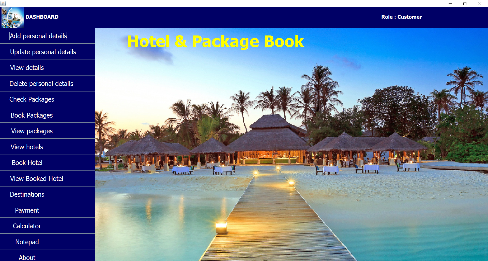
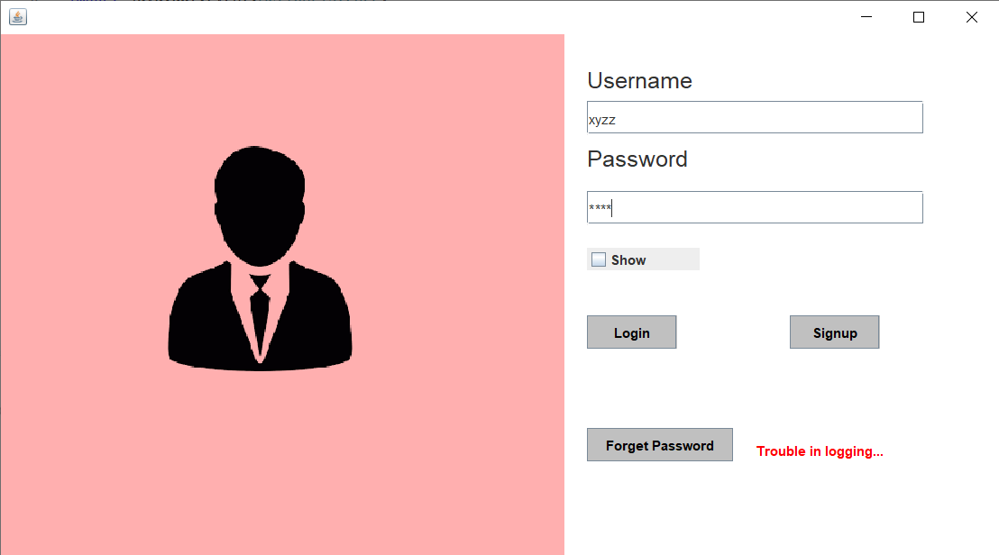
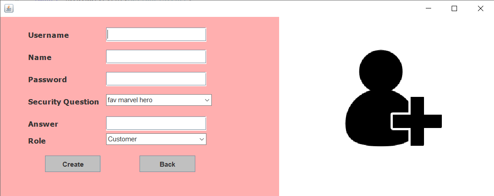
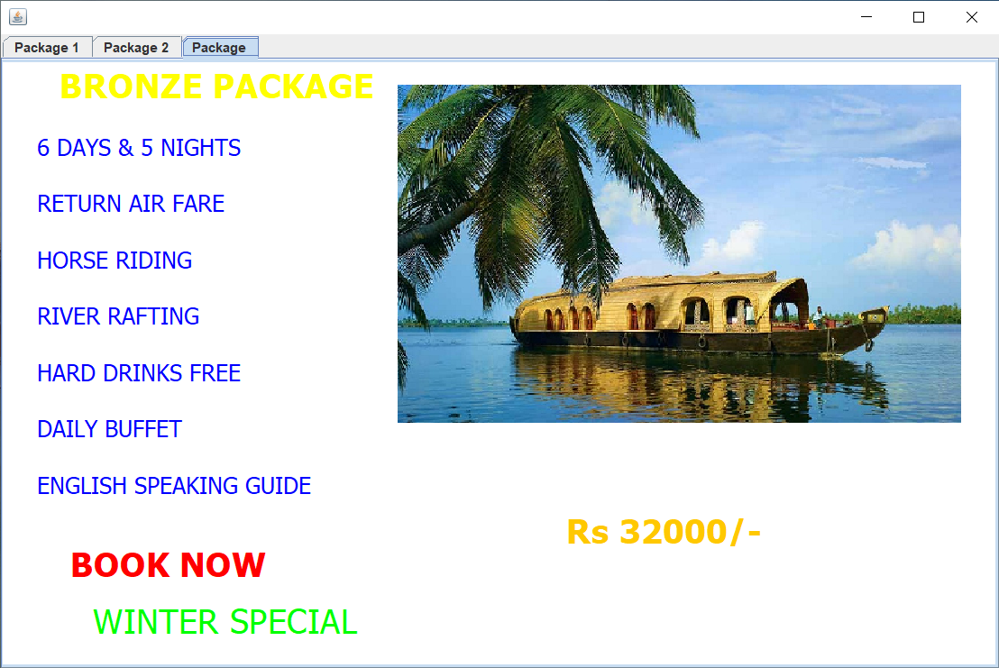
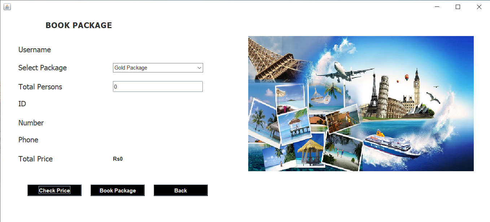
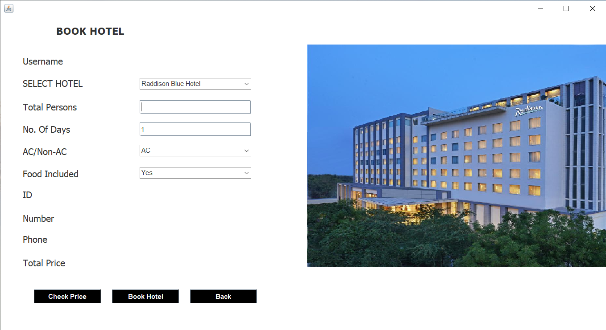
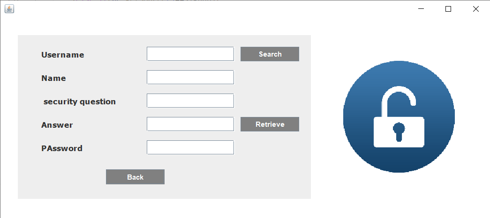

## Overview

A desktop-based Hotel and Package Booking System developed using Java Swing, JDBC, and MySQL. The system allows customers to book travel packages and hotels while administrators can monitor users and bookings through a dedicated admin dashboard.

---

## 📸 Screenshots

Here are previews of the user interface:

### 📊 Customer Dashboard

### 🔒 Login & Signup
| Login Page | Signup Page |
| :---: | :---: |
|  |  |

### ✈️ Travel Packages & Booking
| Check Packages | Book Package |
| :---: | :---: |
|  |  |

### 🏨 Hotel Booking & Recovery
| Book Hotel | Forgot Password |
| :---: | :---: |
|  |  |

---

## Technologies Used

* Java
* Java Swing
* JDBC
* MySQL
* iText PDF

## Features

### Customer Features

* User Registration and Login
* Email Validation
* Password Visibility Toggle
* Travel Package Booking
* Hotel Booking
* Package Cancellation
* Hotel Cancellation
* PDF Receipt Generation
* Forgot Password Functionality

### Admin Features

* Role-Based Login
* Separate Admin Dashboard
* View All Users
* View All Package Bookings
* View All Hotel Bookings

## Database Tables

* account
* bookpackage
* bookhotel

## Enhancements Implemented

* Role-Based Access Control (Admin/Customer)
* Booking Status Tracking
* PDF Receipt Generation
* Input Validation
* Administrative Monitoring Module

## How to Run

1. Create the MySQL database.
2. Import the required tables.
3. Configure database credentials in Conn.java.
4. Add mysql-connector and iText libraries.
5. Compile and run Login.java.
